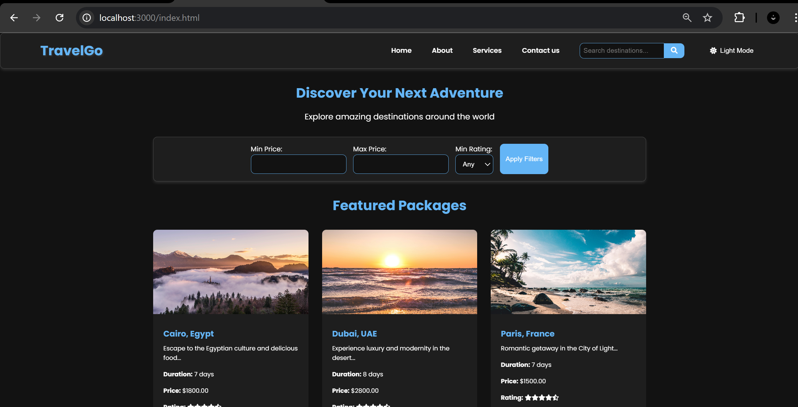

# TravelGo

TravelGo is a simple travel booking web application that allows users to search for and book travel packages. Built with HTML, CSS, JavaScript, Node.js, and MySQL, TravelGo provides a user-friendly interface for planning your next adventure.

## Key Features

### 1. Search & Filter
- Users can search for travel packages by destination, travel dates, and budget.
- Filters available to refine results by price, duration, and rating.

### 2. Travel Package Listings
- Display a list of travel packages based on search criteria.
- Each package includes:
  - Price
  - Rating
  - Brief description

### 3. Package Details Page
- In-depth information about the selected travel package.

### 4. Booking Flow
- A booking form where users can:
  - Select travel dates
  - Enter traveler details
- Form validation is implemented, but no actual booking processing occurs.

### 5. API Integration
- Fetch travel package data from an API (mock data included).

### 6. Mobile Responsiveness
- The application is designed to be fully responsive on both desktop and mobile screens.

---

## Installation & Setup

To get started with TravelGo, follow these steps:

### Prerequisites
- Node.js and npm installed
- MySQL installed

### Clone the Repository
```bash
git clone https://github.com/yourusername/travelgo.git
cd travelgo
```

### Install Dependencies
Run the following command to install the required packages:
```bash
npm install
```

### Set Up the Database
1. Create a new MySQL database:
   ```sql
   CREATE DATABASE travelgo;
   ```
2. Use the provided SQL scripts in the `/database` directory to set up the tables and mock data.

### Configure Environment Variables
Create a `.env` file in the root directory and set the following variables:
```
DB_HOST=localhost
DB_USER=yourusername
DB_PASS=yourpassword
DB_NAME=travelgo
```

### Start the Server
Run the following command to start the server:
```bash
npm start
```

### Access the Application
Open your web browser and navigate to:
```
http://localhost:3000
```

---

## Usage

1. **Search for Packages**: Use the search bar to enter your destination, travel dates, and budget.
2. **Filter Results**: Adjust filters to refine your search results.
3. **View Package Details**: Click on a travel package to see more details.
4. **Book a Package**: Fill out the booking form with your details and preferred dates.

---

## Contributing

Contributions are welcome! If you have suggestions or improvements, please create a pull request or open an issue.

---

## License

This project is licensed under the MIT License. See the LICENSE file for details.

---

## Contact

For any questions or feedback, please reach out to:
- **Shivam Kesharwani**: kesharwanishivam37@gmail.com

---

## Demo



---

Feel free to replace `Shivamk-ux`, `Shivam Kesharwani`, and `kesharwanishivam37@gmail.com` with actual values. Happy travels! 🌍✈️
